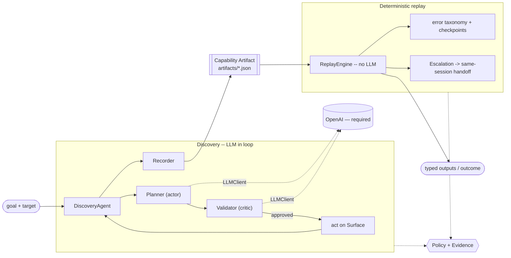

# Design write-up

A quick map first. There are three parties in this system and one contract between
them:

```
 discovery agent ──writes──▶  CAPABILITY ARTIFACT  ◀──reads/invokes── AI agent + human
   (LLM in loop)             (typed, versioned JSON)      replay engine executes it
```

Everything below is organised around making that artifact — and the replay contract
around it — as sharp as possible, because that is where the brief says the evaluation
focuses.

---

## 1. Architecture

The system is a single Python process exposing a CLI, layered so that every part
above the "surface" is unaware of Playwright:

```
CLI/API ─▶ DiscoveryAgent ─▶ Planner (actor) ─▶ Validator (critic) ─┐
           │                via LLMClient       via LLMClient         │ discovery
           │                (OpenAI — required)                       │
           ├─▶ Recorder ─▶ Artifact (artifacts/*.json)  ──────────┘
           │
CLI ─▶ ReplayEngine ─▶ error taxonomy + checkpoints     ┐ production
           │            (no LLM in the loop)             │ execution
           └─▶ Escalation ─▶ same-session handoff        ┘
All actions pass through: Surface abstraction  +  Safety policy  +  Evidence log
```



**Key decisions and trade-offs**

- **One planner, one client interface, one required provider.** All model access —
  for both the planner ("actor") and the validator ("critic") — goes through a single
  `LLMClient` (`agent/llm.py`) with exactly one implementation: `OpenAIClient`. There
  is deliberately **no offline fallback in the product**: `build_client` raises without
  a key, so routing/discovery/validation refuse to run rather than silently faking a
  model. Trade-off: you cannot exercise the model-driven paths without credentials — a
  cost I accept because a heuristic pretending to be a model is exactly the kind of
  hidden default this system is supposed to avoid. Unit tests inject their own explicit
  `LLMClient` double (`tests/fakes.py`) to exercise loop/parsing wiring in CI; it never
  ships in `src/`.
- **A validator agent guards every discovered action.** The planner proposes; a
  separate `ActionValidator` ("critic") approves or vetoes *before* the action runs,
  in two layers: a deterministic policy layer (the same allowlist/risk gate the rest
  of the system uses — authoritative, cannot be argued out of a decision) and an LLM
  layer that judges the action semantically (on-goal? uses only supplied data? about
  to take an irreversible step the goal never asked for?). Repeated rejections stop
  the run rather than looping. This is the "guardrail on each action" the actor/critic
  split is designed for. Replay stays LLM-free by design, so its guardrail is the
  deterministic policy alone.
- **Discovery and replay are different execution modes, not different code for the
  UI.** Both drive the *same* `Surface` and pass through the *same* `Policy`. The
  only difference is who decides (a planner vs. the recorded steps) and how strict the
  policy is (discovery is human-initiated and supervised, so it may record an
  irreversible step; unattended replay gates that class by default).
- **Single process, synchronous.** The problem is a sequential UI flow; a queue or
  service split would add operational surface without buying anything for a vertical
  slice. The seams that *would* become service boundaries (surface driver, artifact
  store, escalation transport) are already interfaces.
- **Evidence is a first-class output**, written for every run and redacted at the
  choke point, so a run is debuggable after the fact without re-instrumenting.

---

## 2. Artifact schema

`src/cua/schema/artifact.py`. An artifact is a **callable capability**, not a step
list. It expresses a full contract:

- `name`, `version`, `description`, `goal`, `approval_state` (draft→approved),
  `stability_score` — so both a human reviewer and a calling agent understand what it
  does, whether it's trusted, and how reliably it replays.
- `params: [ParamSpec]` — typed inputs, `required`, `example`, and crucially
  `sensitive`. Credentials are `sensitive`, which drives redaction and the rule that
  their values are **never persisted** (no `example` stored).
- `outputs: [OutputSpec]` — typed return shape, each traced to the `source_step` that
  produced it.
- `steps: [Step]` — ordered actions; each targeting step carries a `Locator` and a
  `RiskClass`.
- `success_checkpoint: Checkpoint` — the condition that certifies the goal was reached.
- `target: TargetSpec` — identifies the **vendor product** (`app_signature`) plus an
  allowlist of canonical routes, not one hard-coded URL.
- `variants: [VariantOverride]` — per-tenant locator **and checkpoint** overrides (§4).
- `provenance: Provenance` — the discovery `run_id`, planner + model that produced it,
  and a `flow_sha256` integrity hash — traceable to `/evidence` without embedding the
  raw transcript. `stability_score` is written by the multi-run harness (§3), not
  asserted; `approval_state` (draft→approved) gates unattended use on that score.

The schema is validated on load (`validate_contract`): every `READ` must feed a
declared output, every templated value must reference a declared parameter, each
output must trace to a real step, and a checkpoint may never reference a sensitive
parameter. A malformed capability is rejected before it can be replayed.

**Why it's shaped this way.** The single most important design choice is that a
`Locator` is an **ordered list of candidates**, each with a `strategy`, a `rationale`,
and a `confidence` — not one selector. Replay tries them in order and uses the first
that resolves, so the loss of one attribute degrades gracefully instead of breaking
the flow. Candidates are ranked most→least robust:
`role+accessible-name → label → placeholder → id/css → visible text → coordinates`.
Semantic strategies (role, label) are preferred precisely because they map onto the
accessibility tree, which is more stable than legacy markup and also exists on desktop
apps. Concrete values are generalised into typed parameters at record time
(`"100001" → {{member_id}}`) and routes are canonicalised (`/member/12345 →
/member/:member_id`), which is what makes an artifact reusable rather than a
single-use recording. The whole thing is Pydantic → JSON, versioned by
`schema_version`, and deliberately decoupled from the raw model transcript (which is
kept only as redacted evidence).

---

## 3. Determinism & error handling

**Determinism.** Replay (`replay/engine.py`) walks the ordered steps with **no model
in the loop**. Targeting is deterministic via the ordered candidate list; templated
values are resolved from typed params; navigation is reproduced by the recorded clicks
(the app drives its own redirects). Transient conditions (slow load, a momentarily
missing control) are absorbed by a bounded retry with backoff. The run only counts as
success when the `success_checkpoint` verifies.

**Error handling** is the heart of the replay contract. Because these UIs are stable,
the interesting failures are *runtime conditions*, so after each step the engine
classifies the resulting page (`replay/errors.py`) into four buckets and responds
deliberately — and this maps onto the result `Outcome`:

| Condition | Example | Response | Outcome |
|-----------|---------|----------|---------|
| **Business outcome** | "No such member", "Permission denied", validation rejected | stop, return a machine-readable `business_code` | `business_outcome` |
| **Recoverable** | interstitial notice, transient load | dismiss/retry, **re-check it cleared** | `recovered` / `success` |
| **Session timeout** | bounced to login *after* auth | re-authenticate (via escalation) | `success` or `escalated` |
| **Incomplete request** | a required caller input is missing | refuse to fabricate it; return what's missing (no surface work) | `needs_input` |
| **Hard failure** | locator unresolvable, checkpoint fails, app error | stop with step/expected/observed + screenshot | `hard_failure` |

The distinction the brief calls the "most common design mistake" — business outcome
vs. crash — is explicit: `member_not_found` is a **successful execution** returning a
valid negative answer, not a failure. The rules are *data* (`DEFAULT_RULES`), so a
tenant/vendor can extend the taxonomy without touching the engine.

**Ordering is a correctness point.** The same "can't proceed" text means *session
timeout* when a login form is present but a *hard app error* when it isn't, so the
login/session check runs before the rule scan (the login screen is a legitimate part
of the flow, so "/login" only means timeout once we've already passed login — the
engine tracks that).

**Bounded, evidence-backed recovery.** A recovery only *counts* if the blocking
condition is actually gone afterwards: the engine re-observes and re-classifies after
each attempt. If the condition keeps returning past a bound it stops with
`recovery_exhausted` rather than looping or falsely proceeding — a distinct, honest
outcome. Every runtime condition is reproducible on demand via `--inject`
(`session_timeout`, `app_error`, `slow_load`, `persistent_notice`), so each branch has
evidence a real run regenerates. Each targeting step also records **which locator-ladder rung
fired**; a run-level `drift` summary flags how many steps needed a fallback — the
early-warning signal that a control was relabelled.

---

## 4. Heterogeneity & multi-tenant

**Surface abstraction.** The seam is `Surface` (`surface/base.py`). Everything above
it — planner, recorder, replay, escalation — is written against `Surface` + `Locator`,
never against Playwright. Perception is normalised into an `Observation` (an
accessibility-oriented digest of controls: role, accessible name, editability), and
action is expressed against the artifact's `Locator`. To add a **legacy web** surface
you extend the same driver with coordinate/OCR fallbacks (the `COORDINATES` strategy
already exists in the schema and the web surface). To add a **desktop** surface you
implement `Surface` over the OS accessibility tree (UIA/AX) — and because the primary
locator strategy is already *role + accessible name*, most artifacts port with only
their lowest-priority candidates needing rework. The artifact format does not change.

**Multi-tenant reuse — shipped, not just designed.** An artifact is keyed to a vendor
product via `target.app_signature`, not a tenant URL; `base_url` resolves per
invocation. The mock app serves a second tenant (`?tenant=pioneer`) of the *same*
product that relabels the balance row ("Savings balance" → "Ledger balance") and adds
a decoy row. Instead of re-recording, `cua add-variant` attaches a `VariantOverride`
carrying only what differs — a per-tenant `base_url`, the one relabelled locator, and
a checkpoint override — keyed by step index. `replay --tenant pioneer` reads it
correctly; `replay --tenant pioneer --ignore-overrides` **fails** (checkpoint not
satisfied) rather than reading the wrong cell — proving the override is load-bearing,
not decoration. Drift is detected operationally: the `stability` harness writes a
measured `stability_score`, and every replay reports how many steps fell back to a
lower locator rung, so a variant that starts drifting flags a targeted override rather
than a full rebuild. This keeps "hundreds of tenants × ~20 apps" from becoming
thousands of bespoke recordings.

---

## 5. Escalation & handoff

**Detect.** There are two escalation triggers. *Pre-execution*: the operation
allowlist (§6) routes a request to a human before anything runs — a human-only intent
(transfer/close/…) or an unknown operation raises a queued authorization request with
no live session yet, because nothing has been executed. *Mid-run*: the replay engine
treats a state as "stuck" when a condition is `HARD`, a `SESSION_TIMEOUT`, or a
`RECOVERABLE` condition that policy says needs human judgment (a *compliance-review*
interstitial is exactly such a case — a person should decide).

**Route.** It raises an `InterventionRequest` carrying enough context to act:
capability id, step index, reason, current URL, and a screenshot.

**Take control of the same live session.** This is the design's careful part. The
session is the browser's persistent context; control is a logical lock with exactly
one holder:

```
AUTOMATION ──pause (yield)──▶ HUMAN operates the SAME context/page ──resume──▶ AUTOMATION
```

We deliberately **do not close and reopen** the browser on handoff: closing drops
in-memory session cookies, so it would no longer be the *same* session. When
escalation is enabled the session is launched with a **CDP remote-debugging port**, so
`to_headed_for_handoff` hands back a real endpoint (`http://127.0.0.1:<port>`) that a
human operator attaches to — `chrome://inspect` → `localhost:<port>`, or any CDP
co-browse tool — and drives the exact same context/page; on resume the engine
re-observes and continues from where the human left it. The **control-transfer is
therefore real, not a flag flip**: `FileEscalationHandler` routes to a human (carrying
the CDP endpoint in the intervention request) and waits for a resume signal;
`AutoOperatorHandler` is a scripted stand-in that drives the same live page in-process
so the whole loop runs unattended for the demo. Only the polished operator console UI
is mocked (`escalation/operator_app.py`) — explicitly out of scope by the brief.

**Handing off the session does not suspend the guardrails.** Every operator action
goes through `HandoffControl`, which routes it back through the *same* `Policy` gate
and records it (typed values omitted). A human's irreversible click is refused unless
it carries a **one-shot authorization grant** that the policy consumes — so control
transfer can't become "the human clicked it, so anything goes," and the grant can't be
replayed for a second irreversible step. The resume decision is **advance, not
retry**: escalation happens *after* a step runs and the engine continues from the
*next* step, so a human confirm can never double-fire.

The demo (`replay ... --member-id 222222 --escalate`) shows the full arc: interstitial
detected → escalation raised with screenshot → operator dismisses the notice on the
same session (policed + recorded) → automation resumes → read succeeds → `success`.

---

## 6. Safety

Safety is layered. `safety/policy.py` is a single deterministic choke point every
action passes through, in both discovery and replay; on top of it, discovery adds an
LLM **validator agent** that judges each proposed action semantically.

- **Validator agent (discovery).** `agent/validator.py` checks every planner action
  *before* it executes. Layer 1 is the deterministic policy below (authoritative);
  layer 2 is an LLM critic that vetoes actions that are off-goal, use data not in the
  supplied parameters, target a control that isn't on screen, or take an irreversible
  step a read-only goal never asked for. A malformed critic response fails closed
  (rejects), and repeated rejections end the run instead of looping. Replay is
  intentionally LLM-free, so its guardrail is the deterministic policy alone.
  *Note:* the committed discovery evidence was produced with `--no-validator` to stay
  within free-tier rate limits; the validator is on by default and unit-tested, and was
  observed live correctly rejecting a mis-referenced `read`.
- **Operation allowlist (semantic layer).** Above the route/action gates,
  `safety/operations.py` declares which whole operations may run autonomously. A
  request is classified *before* any execution: an allowlisted operation
  (`lookup_member_balance`, `open_subaccount`) proceeds; a high-blast-radius intent
  (transfer / wire / withdraw / close / delete / freeze …) is **always** routed to a
  human, even if a capability for it exists; and any unknown operation — including
  learning a brand-new capability — requires human authorization rather than running.
  Non-allowed requests raise a queued human-authorization request instead of touching
  the surface. This is the "some actions must go to a person" requirement made
  explicit, and it's an allowlist (default-deny), not a blocklist.
- **Route/host allowlist.** Host + canonicalised route patterns; everything not
  explicitly allowed is denied. The agent (LLM or replay) cannot navigate or act off
  the sanctioned surface.
- **Action-risk gating.** Every step carries a `RiskClass`. `IRREVERSIBLE` actions
  (submit/confirm/create) are **blocked by default** on unattended replay and require
  an explicit `--allow-irreversible` opt-in (which then also flags a confirmation
  point). Discovery is permissive enough to *record* such a step because it is
  human-initiated and supervised — a deliberate, documented asymmetry.
- **One-shot grants for handoff.** Even during human control, an irreversible action
  is refused unless it presents a policy-issued grant that is spent on use (§5).
- **No fabricated inputs (completeness gate).** Recorded `example` values are
  documentation, never live inputs. Before any surface work, an invocation checks that
  every *required, non-sensitive* param was actually supplied by the caller;
  credentials are exempt because they come from secure config, not the request. If a
  required input is missing the run stops with `needs_input` and names exactly what's
  missing — it never falls back to an example or a default. This closes the "wrong
  person" hole: a request like *"open a savings account for alicia"* that omits the
  member id is returned for clarification (or routed to a human) rather than silently
  acting on a defaulted member. The agentic `run` path additionally refuses to spend a
  discovery run on a member-scoped request that has no member id.
- **Redaction & no-persist.** Credentials are `sensitive` params supplied at
  invocation, redacted from every log, and never written into artifacts (no `example`
  stored). A regex redactor also scrubs SSNs, card numbers, emails, and `key=value`
  secrets from all evidence.
- **Contract validation on load.** A capability that would leak a sensitive param via
  a checkpoint, or is otherwise internally inconsistent, is rejected before replay (§2).

**Limits.** The allowlist is route/host-level, not semantic — it can't tell a benign
from a malicious value within an allowed action. Redaction is pattern-based and will
miss unusual PII formats. Risk classification is only as good as the label the recorder
assigns; a mislabeled irreversible step would slip the gate (the one-shot grant bounds
the *blast radius* during handoff but not a mislabel during recording). These are the
first things I'd harden (see §7).

---

## 7. Cuts

Deliberately left thin, at clean seams:

- **Real operator console** — mocked; the control-transfer is real: at handoff the
  live session is exposed on a **CDP endpoint** a human attaches to (`chrome://inspect`
  → `localhost:<port>`), the one-shot grant polices any operator action, and the
  scripted `AutoOperatorHandler` drives the same page in-process for the unattended
  demo. Only the polished co-browse UI is out of scope.
- **Desktop/legacy surfaces** — designed (§4) but only the web surface is built.
- **Coordinate / OCR locator fallback** — the `COORDINATES` strategy exists in the
  schema and `web.py` can act on it, but the recorder never *emits* coordinate
  candidates today, so the "degrade to screenshot on an opaque UI" path is present as a
  seam, not exercised. It's the natural lowest-priority rung to populate when adding a
  legacy/desktop surface (§4); on the current clean-a11y target it would never fire.
- **No offline model** — the system requires a real OpenAI key for
  routing/discovery/validation; there is no in-product stub. CI exercises the loop with
  an injected `LLMClient` double under `tests/`. Committed discovery evidence must
  therefore come from a real model run.
- **Agent-facing surface** — a thin HTTP API (`api.py`: `/capabilities`, `/run`,
  `/invoke/{name}`) plus a minimal chat page is provided as the stretch-goal capability
  interface; the agent-facing *product* that decides what to do is out of scope by the
  brief.
- **Persistence** — artifacts/evidence are files, not a database or queue.
- **Codegen / desktop `AccessibilitySurface` / assisted single-step LLM recovery** —
  designed-for at the seams but not built.

**What I'd build next, in order:** (1) a real co-browse operator console on top of the
existing CDP handoff endpoint (the control-transfer seam is already real);
(2) semantic *value-level* guardrails and a mandatory confirmation broker for
irreversible actions, extending the validator from "is this step type safe" to "is
this *value* safe"; (3) an `AccessibilitySurface` for a desktop app to validate the
surface seam; (4) an assisted, single-step, policy-checked LLM recovery on replay
failure (recorded as evidence) as a middle ground before human escalation.
